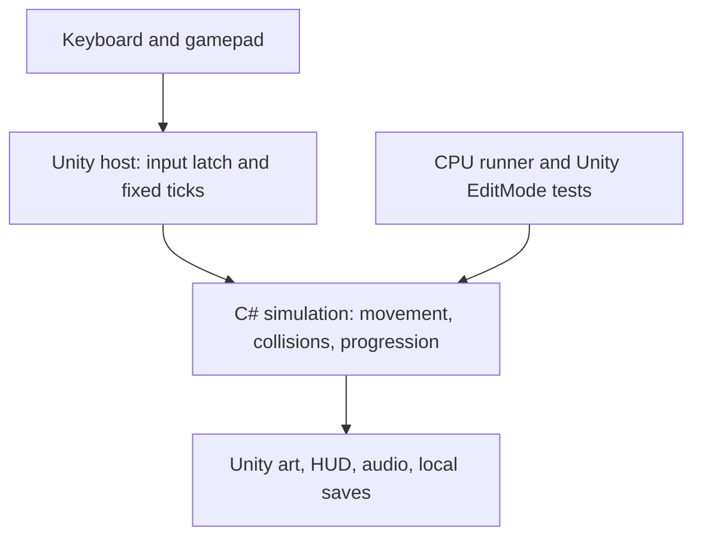

# Architecture

## Simulation ownership

`Assets/Wildbound/Core` has no Unity dependency. `PumaMotor` interprets movement input and maintains launch/charge/contact state. `GameSession` steps moving platforms, carries the player, resolves movement, detects interactions, and updates progress. `WorldDefinition` contains the authored route data. The Unity renderer reads this state; it does not move gameplay colliders.

Positions represent the center of the player's feet. Units increase right and upward. The collision body is 0.9 × 1.05 units; the puma's tail and head extend beyond it for a forgiving silhouette. All terrain uses full solid AABBs. Motion is split into increments no larger than 0.12 units on either axis, below the thinnest authored platform. Axis resolution is followed by contact probes. Broad-phase acceleration is unnecessary at this slice's platform count; profile before optimizing it.

Moving platforms move horizontally and carry grounded players through the same horizontal collision solver. Vertical crushers, slopes, rotation, and moving-platform inertia on takeoff are not implemented.

`GameEvent` is a per-step bitmask. The Unity host handles it immediately in `FixedUpdate`, so render frames cannot swallow multiple physics-step events. Input edges are latched in `Update` and consumed once per fixed tick; held states persist. Pausing clears input and cancels charge. Focus loss pauses the session.

## Rendering and audio

`WorldView` builds a single scene's cut-paper shapes using three generated textures and one shared resource shader/material. Rebuilding a region disables the old root immediately and destroys it at frame end. Particle objects are pooled. Art uses seeded decoration placement; renderer randomness never changes the simulation. The puma is articulated from shapes, with charge compression, paw gait, head motion, and a long tail.

`WildboundHud` is a small immediate-mode prototype UI with a virtual 1280 × 720 layout. Replace it with a production UI only after the flow is stable. The same interface provides title, field guide, contextual lessons, pause, map/return travel, and completion.

`WildboundAudio` creates five short tone clips once and reuses them for feedback. It requires no audio downloads. There is no background music in this slice.

## Persistence

`JourneySave` stores a version, current/furthest region, one pickup bitmask per region, checkpoint indices, and completion. `Sanitize` bounds or resets malformed data. IDs are the pickup positions in each region's list; changing their order requires a save migration or a version bump. There are currently 13 pickups per region and bit zero is the memory.

`PlayerPrefs` serializes the save as JSON, debounced after progress changes and flushed on quit/focus loss. Input state, velocity, current enemy animation, death count, and elapsed simulation time are not persistent. Revisiting a region respawns at its recorded checkpoint and resets its thornlings/moving-platform phase. Online accounts and telemetry are absent.

## Editing safely

- Tune movement in `MovementTuning` first, then replay regression routes.
- Edit platform, pickup, checkpoint, and sign positions in `WorldDefinition.Create`.
- Keep checkpoint spawns above safe supporting surfaces and outside hazards; the tests check all nine initial/checkpoint combinations.
- Keep colliders at least 0.13 units thick or revisit the collision step bound.
- Use Unity to move/rename assets so their GUIDs remain stable. `.meta` files are committed.
- `tools/validate_project.py` checks metadata, references, input mode, and template placeholders; it does not compile Unity code.
- `tests/Wildbound.Tests.csproj` compiles the same core and shared cases used by the EditMode adapter. It cannot validate Unity APIs, shader compilation, or browser behavior.
