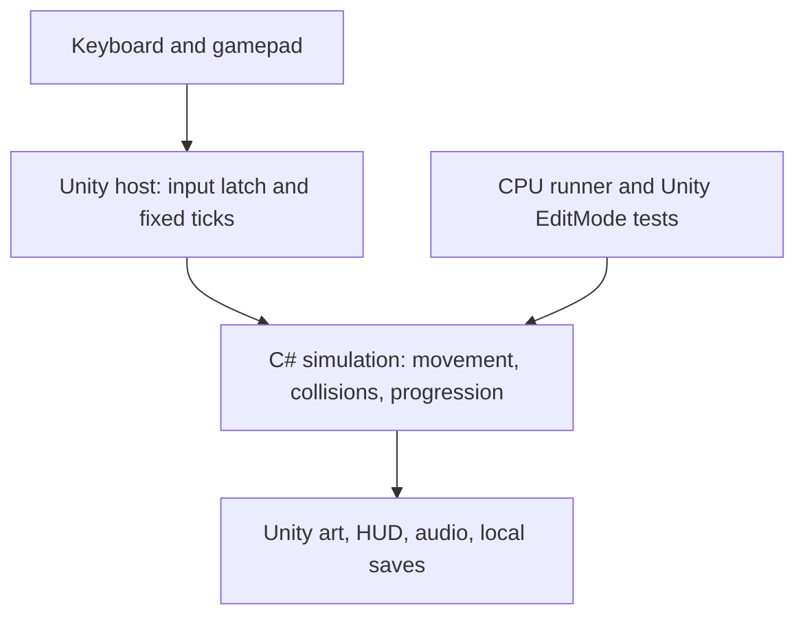

# Architecture

## Simulation ownership

`Assets/Wildbound/Core` has no Unity dependency. `PumaMotor` owns movement, charge, dash, roll, and contact state. `PumaCombat` owns attack timing, buffers, hit tracking, armor decisions, health, and hunting rewards. `Enemy` contains distinct deterministic state machines; `WorldCollision` provides shared terrain queries and swept segment intersections. `GameSession` orders them and owns progression. `WorldDefinition` contains authored terrain, wildlife, and moonbloom-to-bridge links. The Unity renderer reads this state; it does not move gameplay colliders.

Positions represent the center of the player's feet. Units increase right and upward. The collision body is 0.9 × 1.05 units, reduced to 0.58 units tall during a roll. Standing waits until the taller box fits; a blocked puma can crawl out but cannot jump or pounce inside a low ceiling. The tail and head extend beyond the body for a forgiving silhouette. Enabled terrain uses full solid AABBs; dormant moonbridges are non-solid. Motion is split into increments no larger than 0.12 units on either axis, below the thinnest authored platform. Axis resolution is followed by contact probes. Broad-phase acceleration is unnecessary at this slice's platform count; profile before optimizing it.

Each tick advances timers, carries the player, processes attack intent, prepares movement, applies attack impulses, and advances enemies. Every player motion substep resolves terrain, claw/body strikes, hazards, and enemy contact. A successful falling strike interrupts descent immediately. Projectiles then use swept intersections against terrain and the player; the nearest intersection wins. Shots have a three-second lifetime and a global cap of 24.

Attacks have windup, active, and recovery intervals. Each sequence records targets already hit, preventing per-frame damage. Strike boxes have terrain line-of-sight checks and generous reach; their procedural arc graphics need human alignment review. Roll/dash may cancel recovery but cannot erase a committed windup. Damage interrupts attacks and grants a grace interval. Terrain hazards always trigger recovery, regardless of a dodge.

Moving platforms move horizontally and carry grounded players through the same horizontal collision solver. Vertical crushers, slopes, rotation, and moving-platform inertia on takeoff are not implemented.

`GameEvent` is a per-step bitmask. The Unity host handles it immediately in `FixedUpdate`, so render frames cannot swallow multiple physics-step events. Input edges are latched in `Update` and consumed once per fixed tick; held states persist. Pausing clears queued input and cancels pounce charge while freezing the current attack/enemy phase. Focus loss pauses the session. Missing/disconnected input devices clear held movement while save/toast timers continue.

## Rendering and audio

`WorldView` builds a single scene's cut-paper shapes using four generated textures and one shared resource shader/material. Its `WorldCombatView` partial file renders creature silhouettes, telegraphs, scent rings, moonblooms, bridge visibility, and claw arcs. Glow uses translucent sprite layers; there are no dynamic light/shadow physics or URP dependencies. The puma and interactive edges use bright accents against three night palettes.

Rebuilding a region disables the old root immediately and destroys it at frame end. Particles, 24 projectile sprites, and 36 claw segments are pooled. Art uses seeded decoration placement; renderer randomness never changes the simulation. The puma is articulated from shapes, with charge compression, paw gait, head motion, a long tail, and roll/stalk/attack poses. Reduced motion disables camera shake and limits impact particles.

`WildboundHud` is a small immediate-mode prototype UI with a virtual 1280 × 720 layout. Replace it with a production UI only after the flow is stable. The same interface provides title, field guide, contextual lessons, pause, map/return travel, and completion.

`WildboundAudio` creates nine short clips once, including a filtered-noise claw whoosh and tone cues for armor, damage, hunting, and moonwake. It requires no audio downloads. There is no background music in this slice.

## Persistence

`JourneySave` stores a version, current/furthest region, one pickup bitmask per region, checkpoint indices, and completion. `Sanitize` bounds or resets malformed data. IDs are the pickup positions in each region's list; changing their order requires a save migration or a version bump. There are currently 13 pickups per region and bit zero is the memory.

`PlayerPrefs` serializes the save as JSON, debounced after progress changes and flushed on quit/focus loss. The v1 save schema remains compatible: health, instinct, hunt counts, enemies, activated moonblooms, and transient simulation state are not saved. A fall clears attacks/projectiles, restores vitality, and returns surviving enemies home; defeated wildlife and awakened bridges remain as they were during that visit. Region travel reconstructs wildlife, blooms, and platform phases. Hunt/defeat totals last for the current game session only. Online accounts and telemetry are absent.

## Editing safely

- Tune movement in `MovementTuning` first, then replay regression routes.
- Edit platform, pickup, checkpoint, and sign positions in `WorldDefinition.Create`.
- Tune strike intervals in `PumaCombat.ForMove`; tune enemy tells/commitment/recovery in `Enemies.cs`. Keep visible telegraphs and vulnerable windows when changing speeds.
- A moonbridge's `LightSource` is an index into `World.Blooms`; its initial `Enabled` must be false. Put dazzle encounters within five units of their bloom with clear sight lines.
- Keep checkpoint spawns above safe supporting surfaces and outside hazards; the tests check all nine initial/checkpoint combinations.
- Keep colliders at least 0.13 units thick or revisit the collision step bound.
- Use Unity to move/rename assets so their GUIDs remain stable. `.meta` files are committed.
- `tools/validate_project.py` checks metadata, references, input mode, and template placeholders; it does not compile Unity code.
- `tests/Wildbound.Tests.csproj` compiles the same core and shared cases used by the EditMode adapter. It cannot validate Unity APIs, shader compilation, or browser behavior.
