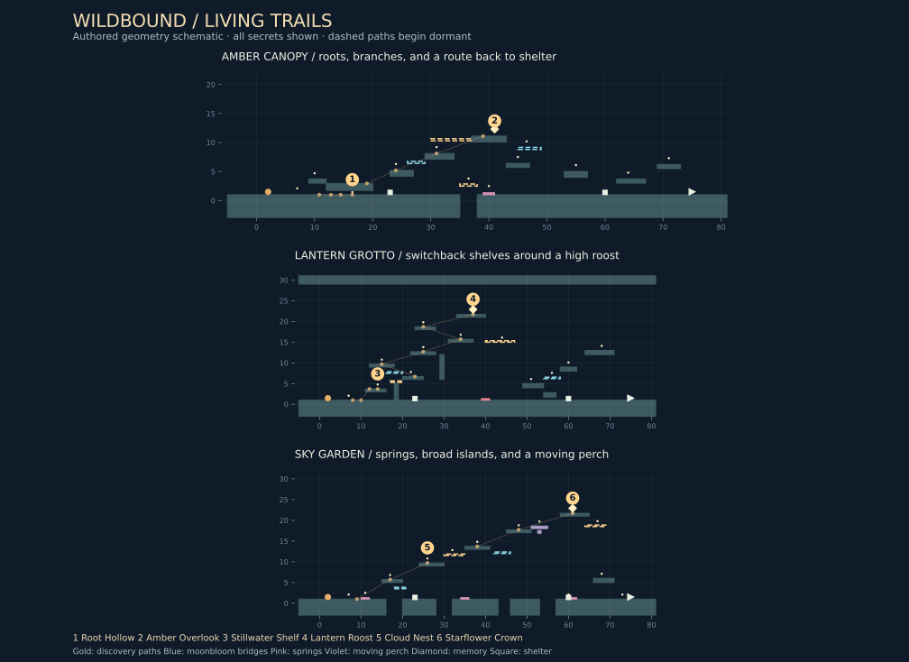

# Living Trails: places worth finding

v0.4 rebuilds the three outside regions around distinct routes. The Moontrail's optional trial rooms and waystone rewards remain available at the starting crescents. The new exploration loop is: notice a physical clue, follow it using the puma's existing moves, arrive at a wild place, and open a lasting route back.

There are six wild places, two per region. Each has nearby pawprints, a short field note, a small environmental vignette, and a golden path that becomes solid when the place is discovered. Arriving on the supporting surface discovers it automatically; a flyby above the destination does not. Collecting everything is optional.

## The regions

| Region | Authored character | Wild places | Encounters |
| --- | --- | --- | --- |
| Amber Canopy | A low root passage, an ascending branch loop, and broad lower recovery ground. There are no lethal bramble patches on this introductory trail. | Root Hollow under the roots; Amber Overlook above the forest. | A hare near the opening, a thornling in the central clearing, a spitter on a side ledge, and a bristleback near the exit. |
| Lantern Grotto | A tall chamber with alternating shelves, a solid roof, and an eastern descent. The lower trail remains available. | Stillwater Shelf above the first pool; Lantern Roost at the top of the chamber. | Moths pressure the climb and the second moonbloom; stone cover and a low arch offer approaches to the spitter. |
| Sky Garden | Separate lower islands and an ascending chain of broad upper landings. Springs and a moving perch connect movement opportunities. | Cloud Nest on the first high island; Starflower Crown above the moving perch. | Moths cover selected approaches; a thornling occupies a lower island and a spitter guards an elevated side landing. |

This is a coordinate schematic, not a screenshot. It exposes every secret for design review, omits wildlife and decorative art, and shows moving platforms at their home positions. Generate it with `python3 tools/render_regions.py` after installing matplotlib. The in-game map uses each region's bounds and marks wild places only after discovery.

## Three journeys to try

**Canopy:** approach the pawprints before the root roof. Roll with L / gamepad B, then keep moving while crouched to reach Root Hollow. Exit the passage, climb onto its roof from either end, and use upward charged pounces between the branches. Amber Overlook holds the memory. Its golden branch lets you return west; descend through the opening between the lower branches to the first shelter. Finding the hollow also opens a golden crossing over the forest-floor gap.

**Grotto:** land on Stillwater Shelf, then climb the switchback: right, left, right, right, left, right. Face the next shelf before charging; upward aim provides height. The Lantern Roost holds the memory. Its golden shelf opens an eastern descent through the side ledges toward the second shelter. The second blue bloom still interrupts the nearby moth. The low arch can be rolled under, while its top offers another approach to the spitter.

**Sky:** jump onto the first pink spring. Steer toward the broad landing above it, then coil toward Cloud Nest. The nest opens a golden stepping path to the higher islands. Cross the moving perch, reach the crown, and collect its memory. The golden eastern landing leads down toward the exit side. Returning toward the second shelter requires jumping over the low spring rather than trying to walk through its solid side.

These are suggested routes, not mandatory sequences. The simulation tests execute all three from their real spawns with wildlife active, including a return to shelter. Their steering policies establish reachability; first-time difficulty and comfortable keyboard timing still need human playtesting.

## Reading the night

- Physical pawprints remain visible without a special mode. Holding Q / LT adds golden scent rings to nearby clues with a clear terrain sight line. It never reveals an entire path through walls.
- A nearby undiscovered trail supplies a short hint in the existing lesson area when no sign is active. Finding the place stops its scent guidance.
- Blue bridges respond to moonblooms and waystones. Golden bridges respond to wild-place discovery. Both show faint outlines while dormant and remain solid after activation for the visit.
- A found wild place blooms with starflowers. Shelter stars reflect the three collected memories, so discoveries leave a visible mark when the puma comes back.
- Tab cycles between the map, waystone objectives, and the current region's wild-place notes. Golden map marks show places already found.
- Reduced motion keeps scent cues still and retains the existing limits on camera shake and particles.

## Progress and implementation

`WorldRegions.cs` contains separate Canopy, Grotto, and Sky builders. Common setup is limited to persistent pickup/checkpoint contracts, boundaries, and the opening practice area. There is no shared outside platform spine. `WorldDefinition` also supplies vertical camera limits and map bounds; the existing Moontrail rooms supply their own map width.

`WildPlaceId` assigns explicit permanent IDs 0–5. `JourneySave.Discoveries` stores a six-bit mask in the existing version-1 save. An older save defaults this new field to zero while retaining its pickups, checkpoints, completed journey, and waystones. Place-list order is independent of the saved identity. Do not renumber these IDs.

`Platform.DiscoverySource` links a golden bridge to a permanent place ID. Arriving opens that place's bridges and emits a discovery event, which the Unity host saves. Re-entering or reloading reconstructs the same paths. Falls and trial excursions preserve them. Discoveries do not grant health, instinct, a region unlock, or journey completion; waystones still govern the blue bridges separately.

Pickup bit zero remains the memory, followed by twelve motes. Checkpoint indices remain 0 and 1 at the same saved positions. Moving these pickups with the revised layout retains their collected state. No save-version reset is used.

## Qualification and the next expansion

See [the current validation evidence](VALIDATION.md). Automated checks cover state, save compatibility, local scent visibility, all six places, all three memories and returns, the outside exits, and the existing trial routes. Syntax parsing includes Unity-facing C# but does not resolve Unity APIs or compile shaders.

In Unity, first inspect whether the root opening reads as rollable, whether the Grotto makes its next shelf visible, and whether the Sky camera shows the landing before the player commits. Check that golden bridges appear to connect to meaningful routes, that scent and teaching text remain legible, and that every mote can be collected comfortably. Tune first-play duration from observation; no duration or fun rating is claimed by the headless tests.

Cinder Ravine, Frostglass Ridge, updraft fields, and new enemy archetypes remain design candidates. The next addition should build on the strongest observed interaction. This pass builds regional encounters with existing wildlife and the current moveset.
