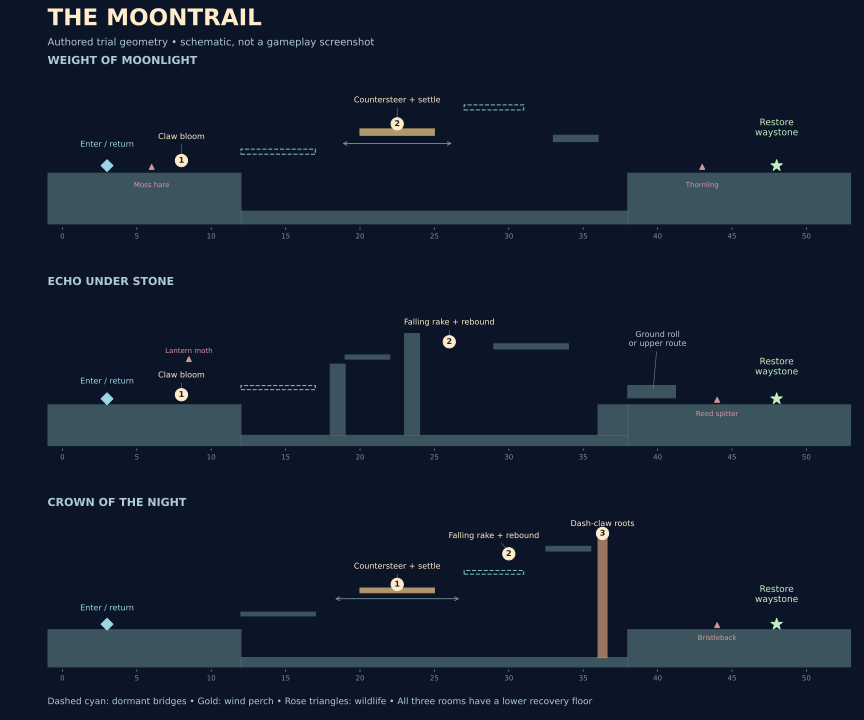

# The Moontrail: objectives that ask more of your paws

v0.3 adds three optional **Waystone Trials**, each a small authored room with a concrete goal: light its mechanisms, reach the far sanctuary, and restore that region's waystone. This builds on the existing night hunt rather than adding another row of combat buttons.

Enter with **E / gamepad Y** while standing near the crescent stone at the start of a region. The right-hand objective card names the next mechanism and shows its direction. **Tab → Show objectives** opens the journal; **C → Trial strategy** explains the combinations. Completing all three waystones restores the Moontrail, separately from finishing the main three-world journey.

## The three challenges

| Trial | Concrete objectives | Ability combination | Strategic choice |
| --- | --- | --- | --- |
| **Weight of Moonlight — Canopy** | Wake the moonbloom; settle the moving lantern perch; reach the waystone. | Claw → jump onto the revealed crossing → upward pounce → countersteer while stalking → leap onward. | Commit to the landing first. Stabilizing the perch and charging a pounce cannot happen together. Once settled, its wind stops and the next bridge stays lit. |
| **Echo Under Stone — Grotto** | Wake the crossing; ring the moonbell from above; reach the sanctuary beyond the spitter. | Moonwake → jump/pounce or wall climb → falling rake → rebound → renewed pounce or dash. | The bloom also dazzles the nearby moth. At the far end, a grounded roll fits under the low arch; staying high offers another approach to the spitter. |
| **Crown of the Night — Sky** | Settle the wind perch; ring the elevated moonbell; breach the braided roots; reach the waystone beyond the bristleback. | Precise landing → balance → climb to the bell → downward rake → steer the rebound → dash-claw a visible gate surface. | A powerful leap can pass above the roots, but they must still be broken to restore the sanctuary. Choose where to descend and commit, then bait or vault the guardian's charge. |

*This is a schematic generated from the v0.3 room geometry, not a screenshot or a recording of play. Numbers identify mechanisms. The diagram shows the perch's home position; arrows indicate its travel.*

## What balancing actually means

The lantern perch moves horizontally. When the puma stands on it, a wind ribbon indicates a rightward push that varies between 0.8 and 1.5 units per second. Holding Q / LT lowers her movement speed, but does not automatically solve the balance. Tap against the push to remain within **0.65 units of the perch's center**.

While stalking, centered, moving slowly relative to the wind, and neither charging nor attacking, her lantern fills over **1.6 seconds**. Drifting out or beginning another action drains partial charge. At full charge, the perch attunes, the local wind stops, and its linked bridge becomes solid. That completed step survives a fall.

The choice is about movement timing: settle first and launch from a stable position, or recover a poor landing before committing. There is no additional stamina currency or random slipping rule. The implementation uses a rectangular moving platform plus controlled drift; it does not simulate a rotating seesaw.

## Using a claw as a stepping stone

A moonbell is a durable violet rebound anchor. Get above it and use **down + claw**. A side swipe, a missed rake, or a strike through intervening terrain does not activate it. A connected falling rake launches the puma upward at 14 units per second and restores her pounce and aerial dash availability. It gives no heart, hunt credit, or instinct.

Directional intent now takes precedence during a pounce: down + claw turns that leap into a falling rake. Once the rake reaches recovery, a fresh pounce press can cancel the recovery into a coil; windup and active attack frames still commit. Existing dash/roll recovery cancels remain available. The normal dash cooldown still applies after a refresh.

For example, in the grotto: claw the first bloom to open the crossing and interrupt its moth, reach the high stone, jump above the bell, rake down, then spend the rebound on the far ledge. You can take the higher approach to the spitter or descend to the low arch and time a roll. The bell provides momentum and a fresh movement option at the point where the route needs them.

Bells can be rung again after a 0.4-second cooldown, with at most one rebound per attack sequence. This permits another attempt without farming combat resources.

## A commitment worth making

The sky room's reinforced roots respond to a **dash-claw**, not a basic sweep. Their vertical shape offers several attack heights. The strike checks the visible gate surface, so a ledge underneath the puma does not incorrectly block an upper hit; intervening cover still blocks the breach.

Breaking the gate removes a real collision barrier. The bristleback beyond it still has its own rules: a guarded front, a visible committed charge, and vulnerable recovery. Neither the gate nor the enemy grants general dash invulnerability. Crossing above the guardian is a valid alternative to fighting it.

The game recommends a sequence through its objectives, but does not reject mechanisms activated in another order. The physical result matters: a lit bloom, attuned perch, rung bell, or broken gate. Killing every creature is never a completion condition.

## Rewards and failure

| Event | Result |
| --- | --- |
| Complete all mechanisms and press E / Y near the far waystone | Restore that region's waystone and return to the outside entrance. Its main-world moonbridges remain active across visits and reloads. |
| Reach the sanctuary before finishing | It tells you which mechanism remains. No reward or region unlock is granted. |
| Fall out of the room or lose all vitality | Return to the trial start with full vitality. Lit mechanisms and defeated creatures remain changed; incomplete balance charge clears. |
| E / Y at the starting crescent, or Tab → Leave trial | Return safely to the same outside world and position. Re-entering starts a fresh attempt. |
| Reload during an unfinished trial | Resume the outside region at its saved checkpoint. Partial trial state is not saved. |
| Repeat an already restored trial | Practice again; the saved waystone flag remains a single completion. |

Every room has a lower recovery floor. Falling off an upper route often means finding another approach rather than dying. The existing outside world's collectibles, checkpoints, enemy state, and platform clock are preserved during a trial. Trial entry/exit clears projectiles, attack state, and instinct, and restores vitality.

The save adds one three-bit `Waystones` field to the existing version-1 schema. Old saves default to no restored waystones and keep their progress. Waystones do not unlock undiscovered regions or set the main journey's completion flag.

## What the references contributed

These are our design interpretations, not claims of copied systems:

- **Hollow Knight:** make exploration connect places and change what a return visit offers. Our small implementation is a visible, persistent bridge reward for a completed side challenge. The official description emphasizes interconnected worlds and expanding abilities. [Official site](https://www.hollowknight.com/)
- **Silksong:** connect acrobatic movement with combat. We give those combinations a concrete purpose through environmental objectives. Our falling rake can become the start of the next leap, and the journal records a concrete environmental objective. The official site presents acrobatic action across varied regions. [Official site](https://hollowknightsilksong.com/)
- **Celeste:** author a compact challenge around existing movement and make another attempt understandable. Our rooms introduce a mechanism, ask for a combination, and provide recovery floors. The reference is the game's handcrafted platforming approach, not a claim that its specific systems have been reproduced. [Official site](https://www.celestegame.com/)

No reference game's code, artwork, audio, levels, names, or tuning has been imported.

## Evidence and the next critique

**98 core regression cases pass.** These include completion of all three trials through simulated input with zero deaths, all three outside exit routes, a keyboard-only countersteering check, the authored roll passage, blocked/ineligible strikes, reward persistence, save compatibility, and 18,000 additional trial stress steps. The route policy uses analog steering for jumps and pounces; these results establish reachability, not first-time keyboard difficulty.

Unity compilation/rendering, actual gamepad handling, audio, and WebGL execution remain unverified in this environment. In the first real playtest, evaluate whether players notice the crescent, understand why a perch is not charging, recognize the bell's downward cue, and see where to go after the rebound. Check arc/hitbox alignment and how often the objective panel covers a landing.

The main regions still share their earlier route spine. These three rooms are a focused step toward distinct authored spaces, not a finished metroidvania. The next useful expansion should come from the weakest observed trial: improve its teaching and geometry, then build a larger loop around the successful interaction. New currencies, equipment trees, and bosses should wait until those combinations feel good in the actual game.
